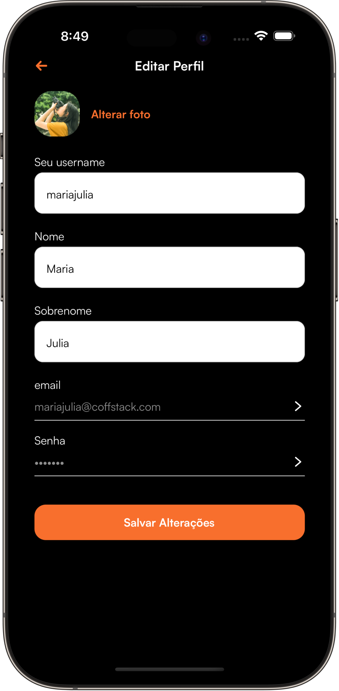
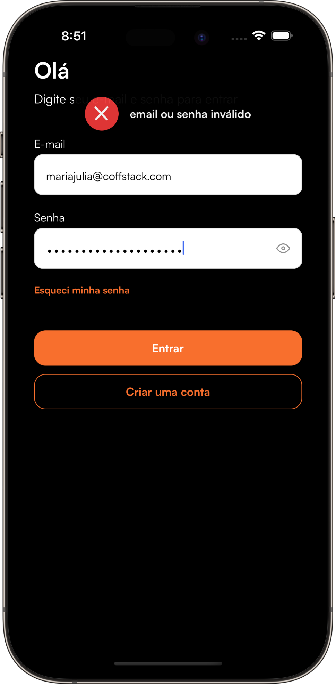

# 📱 Nubble App (Profissional React Native)

Welcome to the Nubble App repository, the project built in the course lessons [PRN (Profissional React Native)](https://coffstack.com.br/profissional-react-native).

|                               |                               |                               |                               |
| :---------------------------: | :---------------------------: | :---------------------------: | :---------------------------: |
|  |  |  |  |
|  |  |  |  |

Take a look on complete Figma with all screens [Here](https://www.figma.com/design/qZVdIhrBpXhyZCPhy1WfAh/App---Nubble-(v.1.1)?node-id=0-1&node-type=canvas&t=4cefBF86AoGmB161-0)!

## ⛏️ Tech (Libraries and Teacnologies)

- [React Native CLI](https://reactnative.dev/docs/getting-started-without-a-framework)
- [TypeScript](https://www.typescriptlang.org/)
- [React Hook Form](https://react-hook-form.com/) e [Zod](https://zod.dev/)
- [Zustand](https://zustand.docs.pmnd.rs/getting-started/introduction)
- [TanStack Query (React Query)](https://tanstack.com/query/latest)
- [Shopify Restyle](https://shopify.github.io/restyle/)
- [React Navigation](https://reactnavigation.org/)
- [EsLint](https://eslint.org/), [Prettier](https://prettier.io/) e [Husky](https://typicode.github.io/husky/)
- More modules are pending for me to start, such as unit test, integration test, CI/CD with Fastlane, React Native Vision Camera and much more.

## 🏗️ Project Architecture

Nubble App adopts a layered architecture with Clean Architecture, SOLID, design patterns and MVVM (Model-View-ViewModel) principles. This structure, validated in projects with thousands of users, aims to create applications that are simple to understand and maintain, as well as scalable in terms of code base and team.

## 👨🏻‍💻 Who is my teacher?

**Lucas Garcez** is a leading React Native expert, with **over 6 years of hands-on experience** in developing high-performance applications for companies in **Brazil and abroad**. Recognized for his unique ability to simplify the complex and for his **practical and didactic approach**, Lucas is a reference in teaching **advanced React Native**. He currently resides in Australia, where he works as a **senior software engineer**, applying the techniques and concepts he teaches on a daily basis. With this, he offers his students **knowledge directly aligned with the demands of the global market**, making him one of the few teachers providing **React Native teaching at the level that companies actually work with**.

- [LinkedIn](https://www.linkedin.com/in/lucas-garcez-a5636b157/?locale=pt_BR)
- [GitHub](https://github.com/LucasGarcez)
- [YouTube](https://www.youtube.com/@Coffstack)
- [Instagram](https://www.instagram.com/lucasgar6/)

